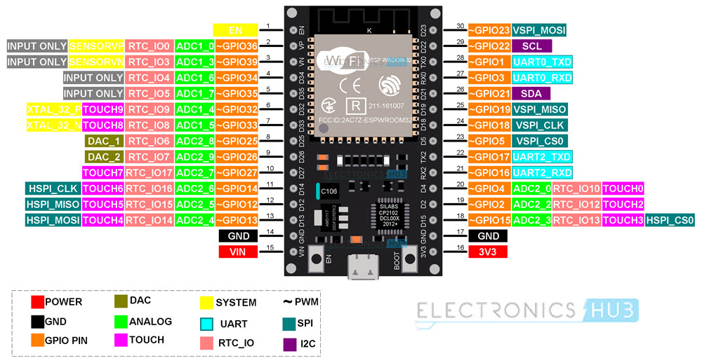
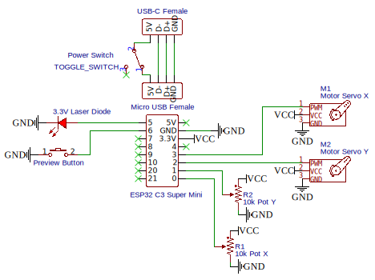
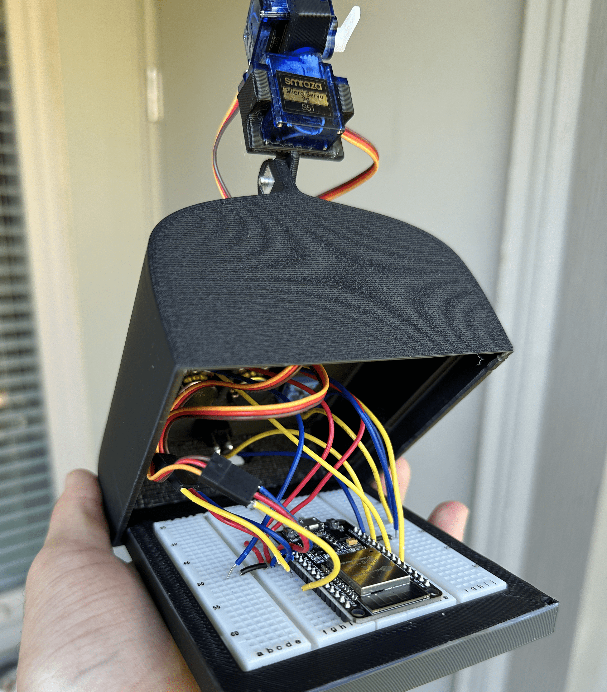

# Random Laser Pointer

## Design Requirements

- The laser should move in a random pattern. Might be harder in a `no_std` environment.
- The laser pattern should be configurable in scale and position. Potentiometers?
- The laser will be controlled with 2 servos via PWM signals.

### Chip Comparison

I have several Arduino Nano (AVR) and ESP32 boards on hand so those are the top contenders for this project:

| Feature                         | Arduino Nano | ESP32  |
| ------------------------------- | ------------ | ------ |
| Rust Development Experience     | x            | ?      |
| `no_std` and `std` Environments | x            | ✓      |
| PWM Control Pins                | 6            | 16     |
| Analog Input Pins               | 6            | 15     |
| Size                            | Smaller      | Medium |

### Chip Selection

I will move forward with the ESP32-WROOM-32 (Xtensa architecture) boards that I have. This will allow me to evaluate the ESP32 Rust development experience with the option of a hosted `std` environment should it be necessary.

[ESP32-WROOM-32 Datasheet](https://www.espressif.com/sites/default/files/documentation/esp32-wroom-32_datasheet_en.pdf)

#### Details

| Detail                 | Value        |
| ---------------------- | ------------ |
| Microcontroller Target | ESP32        |
| Architecture           | Xtensa       |
| Chip                   | ESP32-D0WDQ6 |

## Hardware

- 1 x [ESP32-WROOM-32](https://www.espressif.com/sites/default/files/documentation/esp32-wroom-32_datasheet_en.pdf) (Xtensa architecture)
- 1 x 3.3V Laser diode
- 2 x [SG90 servo motor](/datasheets/SG90_servo_motor.pdf) to position the laser
- 2 x 10kΩ potentiometer to control the servo X and Y range
- 1 x Latching button to preview the laser area
- 1 x Toggle switch to control power
- 1 x USB-C Female connector to connect power

## Wiring

## Rust ESP32 Resources

- [The Rust on ESP Book](https://docs.esp-rs.org/book/introduction.html)

## Final Product

