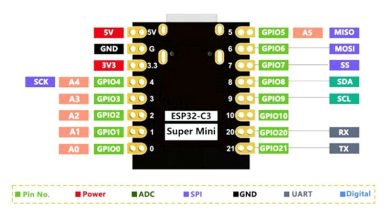

# Random Laser Pointer

## Design Requirements

Random laser pointer station. Embedded Rust

- Laser moves randomly.
- Configurable `x` and `y` area of laser movement.
- Simple USB-C connector for power and programming.



## Hardware

- 1 x [ESP32 C3 SuperMini](https://www.espressif.com/en/products/socs/esp32-c3)
- 1 x 3.3V Laser diode
- 2 x [SG90 servo motor](/datasheets/SG90_servo_motor.pdf) to position the laser
- 2 x 10kΩ potentiometer to control the servo X and Y range
- 1 x Latching button to preview the laser area
- 1 x Toggle switch to control power
- 1 x USB-C Female connector for power and programming
- 1 x 3D printed case


## Wiring


## Rust ESP32 Resources

- [The Rust on ESP Book](https://docs.esp-rs.org/book/introduction.html)

## Development Environment

- Rust via [rustup](https://rustup.rs/)
- Install [ESP32 Rust tooling](https://docs.esp-rs.org/book/installation/index.html)

```shell
cargo install espup
espup install
```
## Final Product

TODO: Add final product image

